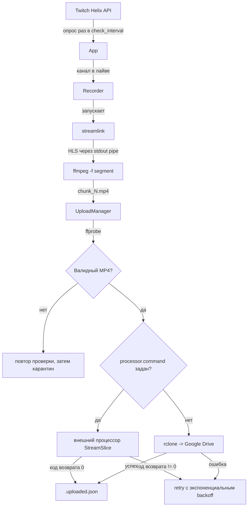

# twitch-recorder

Круглосуточный демон на Python, который следит за списком Twitch-каналов и
автоматически записывает их в MP4-чанки по часу, готовые к дальнейшей
обработке или загрузке в облако.

## Как это работает



1. `App` раз в `check_interval` секунд опрашивает Twitch Helix API
   (`GET /helix/streams`) по всем каналам из `channels`.
2. Когда канал уходит в лайв, для него стартует `Recorder` в отдельном потоке:
   `streamlink` тянет поток и пишет его в stdout, который по pipe уходит в
   `ffmpeg -f segment` - тот режет непрерывный поток на файлы `chunk_N.mp4`
   заданной длины (`chunk_duration`), без перекодирования (`-c copy`).
3. Каждый закрытый чанк проверяется `ffprobe` (`valid_mp4`) - должен быть
   файлом, весить больше 10 КБ и иметь положительную длительность. Три
   неудачные проверки подряд - чанк уходит в карантин и больше не трогается.
4. Валидный чанк попадает в `UploadManager`, который либо передаёт его
   внешнему **процессору** (по умолчанию - StreamSlice, см. ниже), либо
   загружает через `rclone` на удалённое хранилище (Google Drive и любой
   другой rclone remote).
5. Неудачные попытки процессора повторяются с экспоненциальным backoff
   (`processor.retry_initial_seconds` → `... * 2^n`, ограничено сверху
   `processor.retry_max_seconds`), до `processor.max_attempts` раз. Успешные
   загрузки фиксируются в `.uploaded.json` рядом с чанками - при перезапуске
   сервиса уже обработанные файлы не отправляются повторно, а недозагруженные
   подхватываются автоматически.

## Связь со StreamSlice

`twitch-recorder` - самостоятельный сервис, не зависящий от StreamSlice по
коду. Связь - через `processor.command` в конфиге: после каждого готового
чанка сервис запускает внешнюю команду с добавленным `--input <chunk.mp4>` и
смотрит только на код возврата (`0` - успех, что угодно другое - повтор).
В боевой инсталляции это выглядит так:

```
/opt/streamslice/.venv/bin/python /opt/streamslice/tools/process_chunk_for_queue.py \
  --config /opt/streamslice/config/remote.yaml --input <chunk.mp4>
```

Подробности деплоя рядом со StreamSlice - в `docs/DEPLOYMENT.md`.

## Требования

- Python 3.11+
- `ffmpeg` / `ffprobe`
- `streamlink`
- `rclone` (нужен всегда: даже в режиме `processor.command` сервис проверяет
  его наличие при старте)

## Быстрый старт

```bash
python3 -m venv .venv
.venv/bin/pip install -r requirements.txt

cp config.example.yaml config.yaml
cp credentials.example.yaml twitch-credentials.yaml
chmod 600 twitch-credentials.yaml
# впишите свои channels, download_directory и Twitch-секреты

.venv/bin/python twitch_recorder.py --config config.yaml --check-config
.venv/bin/python twitch_recorder.py --config config.yaml
```

Полный процесс установки на выделенный хост с systemd - в
`docs/DEPLOYMENT.md`. Описание каждого ключа конфига - в
`docs/CONFIGURATION.md`.

## Боевой config.yaml намеренно не в репозитории

`config.yaml` и файл секретов (`twitch-credentials.yaml` или как вы его
назовёте) исключены через `.gitignore` - в них живут пути конкретного хоста и
секреты Twitch-приложения, которым нечего делать в git. Вместо них в
репозитории лежат `config.example.yaml` и `credentials.example.yaml`: скопируйте
их под реальными именами (см. "Быстрый старт" выше) и заполните своими
значениями. `deploy/install.sh` делает это автоматически при установке на
хост, но никогда не перезаписывает уже существующие файлы.

## Команды

| Команда | Что делает |
| --- | --- |
| `twitch_recorder.py --config PATH` | Обычный запуск демона: бесконечный цикл опроса и записи. |
| `twitch_recorder.py --config PATH --once` | Один проход опроса Twitch (запускает/останавливает рекордеры по текущему статусу каналов) и выход - полезно для диагностики. |
| `twitch_recorder.py --config PATH --check-config` | Разбирает конфиг и секреты, печатает настройки (секреты маскированы: показывается только длина и последние 4 символа), проверяет наличие `streamlink`/`ffmpeg`/`ffprobe`/`rclone`. Не пишет на диск, не обращается к сети. Код возврата `0`/`1`. |

## Где взять ключи Twitch API

1. Зайдите на https://dev.twitch.tv/console/apps и создайте приложение
   (тип - "Application", OAuth Redirect URL можно указать любой
   `http://localhost`, он не используется).
2. Возьмите `Client ID` и сгенерируйте `Client Secret` - это `twitch.client_id`
   и `twitch.client_secret` в конфиге. Сервис использует
   client-credentials-flow (`grant_type=client_credentials`) и сам обновляет
   токен доступа по мере истечения.
3. `twitch.oauth_token` не обязателен для публичных стримов - он нужен только
   если `streamlink` должен авторизоваться (например, для приватного контента).
   Получить его можно через отдельный OAuth flow приложения-клиента; храните
   его так же, как `client_secret`.

Подробнее про формат и расположение файла секретов - в
`docs/CONFIGURATION.md`.

## Лицензия

MIT, см. `LICENSE`.
